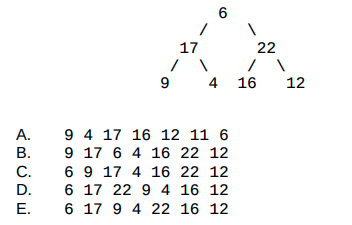
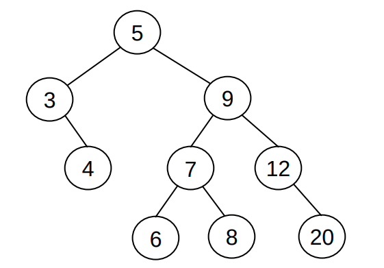
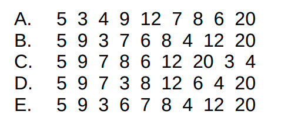
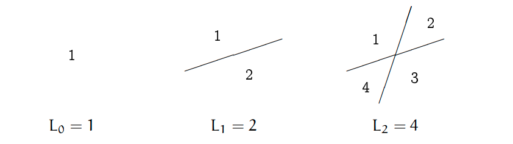
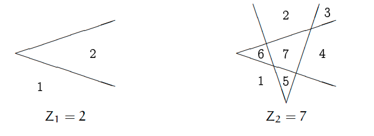
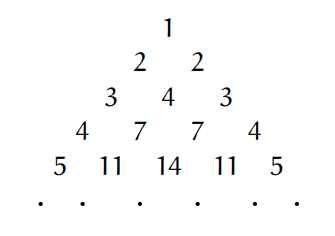

# Table of Contents

1.  [简答题](#org9410caf)
    1.  [分苹果](#org7e48372)
    2.  [地址问题](#org0871aea)
2.  [下面代码段的输出是什么, 并给出解释](#orgf962c52)
3.  [下面程序段输出什么, 并给出解释](#org2d5e20a)
4.  [二叉树如下,使用先序遍历的结果是:](#org9158aa2)
5.  [二叉搜索树如下, 请问以何种顺序输入无法构造这样的二叉树](#orgcfa6ac0)
6.  [将如下输入转换为最大堆](#org961047b)
7.  [将如下输入转换为最小堆](#org4baac97)
8.  [使用直线划分空间](#org6816fd3)
9.  [使用折线划分空间](#orga7b0169)
10. [打印三角形](#org69d208f)
11. [实现atof函数](#orgaa55d5d)
12. [使用栈的数据结构实现队列的功能](#orgf28dfb7)
13. [彩票生成器](#orgd0d73f0)

# 简答题

## 分苹果

一共2000个苹果，有任意多个箱子用来装苹果，要求一个或多个箱子中的苹果数量之和可以得到1到2000中的任意数目的苹果。

请问最少需要多少个箱子才能满足上述条件？

## 地址问题

某计算机内存为64MB, 字长为4字节, 请问其地址总线的取值范围

# 下面代码段的输出是什么, 并给出解释

    let p = []; 
    let s = "string"; 
    let i; 
    for (i = 0; i < s.length; i++) 
         p[i] = s[length - i]; 
    console.log(p.join(""));

-   a) gnirts
-   b) gnirt
-   c) string
-   d) 没有输出

# 下面程序段输出什么, 并给出解释

    let n = 0, m = 0;
    if (n > 0) {
        if (m > 0) {
    	console.log("True");
        }
        else {
    	console.log("False");
        }
    }

-   a) True
-   b) False
-   c) 没有输出
-   d) 运行错误

# 二叉树如下,使用先序遍历的结果是:

# 二叉搜索树如下, 请问以何种顺序输入无法构造这样的二叉树

# 将如下输入转换为最大堆

    {1, 2, 8, 10, 20, 6, 16, 14, 31, 7}

**提示**:  结果应当是唯一的; 你可以使用数组或是画图作为答案.

# 将如下输入转换为最小堆

    {1, 2, 8, 10, 20, 6, 16, 14, 31, 7}

**提示**:  结果应当是唯一的; 你可以使用数组或是画图作为答案.

# 使用直线划分空间

如下图所示:

-   0根直线可以划分出1个空间
-   1根直线可以划分出2个空间
-   2根直线可以划分出4个空间

**问题**:

1.  写出公式L(n); n表示折线数量, L(n)表示通过n根折线可以划分出的最多的空间数量
2.  使用js语言实现计算L(n)的函数
    
        function calc_line_spaces(n); // n >= 0

# 使用折线划分空间

如下图所示:

-   0根折线可以划分出1个空间
-   1根折线线可以划分出2个空间
-   2根折线最多可以划分出7个空间

**问题**:

1.  写出公式Z(n); n表示折线数量, Z(n)表示通过n根折线可以划分出的最多的空间数量
2.  使用js语言实现计算Z(n)的函数
    
        function calc_zig_spaces(n); // n >= 0

# 打印三角形

观察上图三角形的规律,实现函数根据输入n打印n行如图所示三角形.

    fuction draw(n); // n > 0

# 实现atof函数

-   函数定义
    
        function my_atof(str);
-   函数描述
    
    `my_atof()` 会扫描参数str字符串，跳过前面的空格字符，直到遇上数字或 `.` 符号才开始做转换，而遇到非数字或字符串结束时才结束转换，并将结果返回。
    
    以下都是合法输入:
    
        0.123z
        .123k
        16.4cc
        16.
        0.0
        0.
    
        注意: 
          1. 不考虑 +- 符号, 不考虑输入非法的情况 
          2. 使用Number()构造函数无法实现这个功能
             例如: Number(".32b")
        	   NaN

# 使用栈的数据结构实现队列的功能

js的数组已经提供了push和pop的方法, 也提供了length属性.

请使用已有的栈的方法(push, pop)和属性(length)实现一个队列的功能:

要求: 只能使用push和pop以及length, 不能使用其他方法和属性.

请补全下列代码, 要求运行后能输出从1到9

    class Queue{
        constructor() {
    	this.data = [];
    	this.length = 0;
        }
    
        enqueue(item) {
    	// your code
        }
    
        dequeue() {
    	// your code
        }
    
        isEmpty() {
    	// your code
        }
    }
    
    let q = new Queue();
    for(let i = 1; i < 10; i++) {
        q.enqueue(i);
    }
    
    while(!isEmpty(q)) {
        console.log(q.dequeue());
    }

# 彩票生成器

`从红色球号码（1-33）中选择6个号码，从蓝色球号码（1-16）中选择1个号码，组合为一注号码。`

请你根据上述规则实现程序, 生成一个彩票的号码.

